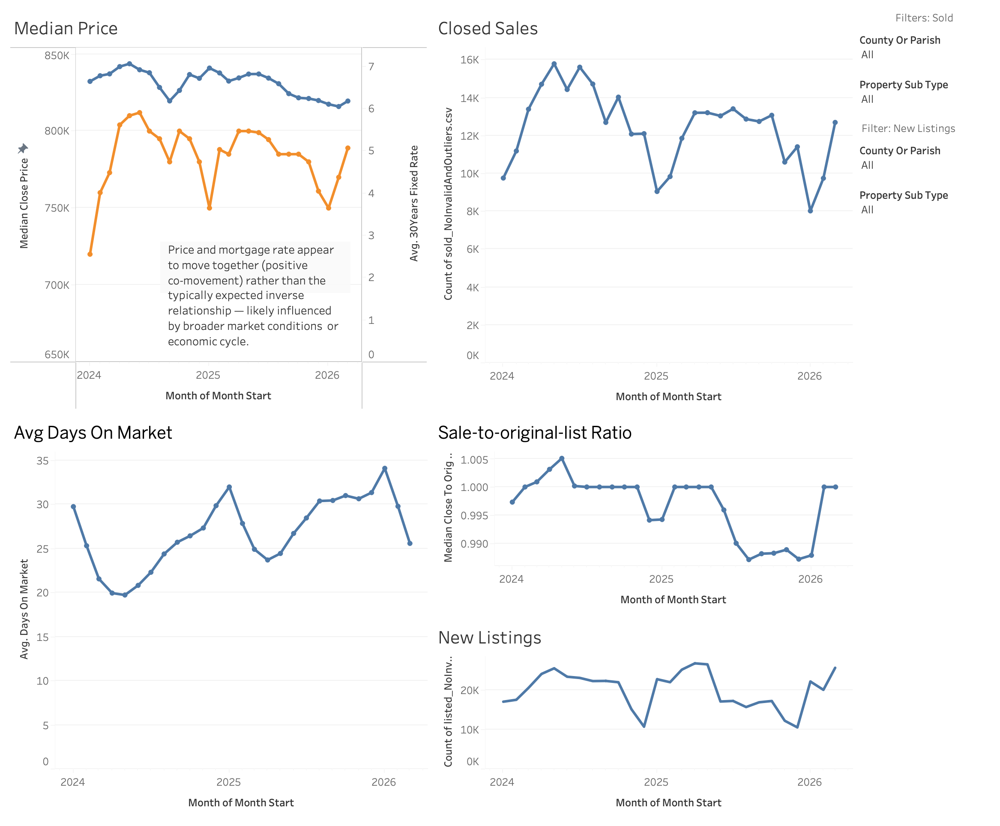
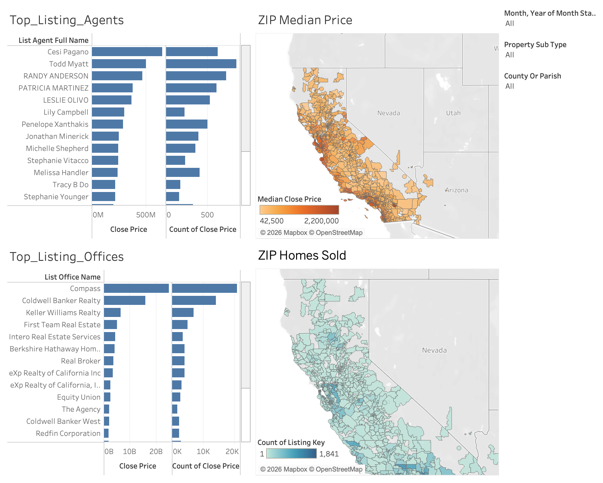

# real-estate-market-analytics

A data analytics project where I analyzed residential real estate market trends using California Regional MLS (CRMLS) transaction data, built during my Data Internship at IDX Exchange.

## 1. Why I built this

I wanted to see what's actually happening in the California housing market - how prices are moving, how fast homes are selling, and whether mortgage rates are connected to any of that. I built a full pipeline myself, from messy raw MLS files all the way to an interactive Tableau dashboard, the same kind of work a real estate data analyst would actually be asked to do.

## 2. Where the data came from

1. The core data is CRMLS (California Regional MLS) monthly listing and sold transaction files, from January 2024 through March 2026. That's 27 monthly files each for listings and sales, filtered down to residential properties only.

2. I also pulled in the 30-Year Fixed Mortgage Rate from FRED (Federal Reserve Economic Data), and merged it in by month.

3. One important note: the raw MLS data is confidential, so I excluded it from this repo using .gitignore. What you see here is just the code and this README - the actual transaction data was never uploaded anywhere.

## 3. How I approached it

1. Merge and clean
   I had 27 monthly CSV files each for listings and sales. The raw files had duplicate columns - the same field got exported twice under slightly different names, like PropertyType and PropertyType.1. I wrote one reusable function to catch and remove these duplicates so I didn't have to repeat the same code 27 times, then merged everything into one table and filtered down to residential properties only.

2. Handle missing data
   I checked what percentage of each column was missing, and dropped any column that was missing more than 90% of its values, since a column that's almost completely empty isn't really usable for analysis.

3. Validate data quality
   Instead of deleting rows with weird or invalid values, I flagged them instead. I added boolean columns for things like invalid prices (zero or negative), invalid square footage, negative days-on-market, dates that didn't make sense in order (like a contract date happening after the close date), and coordinates that fell outside California. This way I kept the full dataset intact but could still filter down to a clean subset whenever I needed to.

4. Feature engineering
   I built new features from the raw fields: price-to-list ratio, close-price-to-original-list-price ratio, price per square foot, and I split days-on-market into two separate phases - listing to contract, and contract to close.

5. Outlier detection
   I used the IQR (Interquartile Range) method on Close Price, Living Area,and Days on Market. I picked IQR over a standard deviation approach because housing prices are right-skewed (a handful of very expensive homes pull the distribution), and IQR handles that kind of skew better.

6. External data integration and visualization
   Last step was merging in the monthly average mortgage rate from FRED and building two Tableau dashboards to visualize everything.

## 4. What I found

1. When I removed the statistical outliers, the median close price shifted by 4.3 percent, from $820,000 down to $785,000. That told me a small number of extreme-priced transactions can meaningfully skew the headline price number.

2. 100 percent of the price outliers I flagged were on the upper bound, none on the lower bound. That actually matches what I'd expect from a right-skewed distribution like housing prices - there weren't any unrealistically cheap outliers.

3. Median close price and the 30-year mortgage rate moved together over this period - both going up and down at the same time - instead of the inverse relationship most people would assume (higher rates usually expected to cool prices down). That's a bit counterintuitive, and it probably means other market factors were driving both at once during this window. I think it's worth digging into further with an actual correlation analysis down the line.

## 5. The dashboards

I built two dashboards in Tableau:

1. Market Overview - median price, closed sales, average days on market, sale-to-original-list ratio, new listings, and median price plotted against the 30-year mortgage rate over time.

2. Competitive Overview - top listing agents and offices by volume, plus maps showing median price and homes sold by ZIP code across California.

